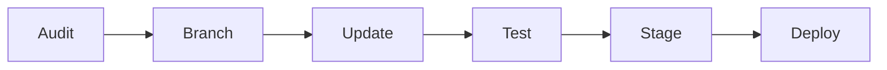

# Dependency Update Guide

MiniOp depends on a stack of runtime dependencies, native binaries, and container images. This document provides a structured approach to keeping them current without breaking your clip generation pipeline.

---

## 1. Dependency Inventory

### 1.1 Core Runtime Dependencies

| Component | Technology | Update Cadence |
|-----------|-----------|----------------|
| API server | Node.js + Express | LTS releases |
| Clip worker | Python + FFmpeg | Monthly |
| Database | PostgreSQL 15+ / SQLite | Major: yearly |
| Cache/Queue | Redis 7+ / BullMQ | Quarterly |
| Frontend | React + Vite | Monthly |
| Object storage | S3-compatible / local FS | N/A |

### 1.2 Native/System Dependencies

```bash
# Check current versions
node --version          # Target: 20 LTS or 22 LTS
python3 --version       # Target: 3.11+
ffmpeg -version         # Target: 6.x+
redis-server --version  # Target: 7.2+
psql --version          # Target: 15+
```

### 1.3 AI/ML Dependencies

MiniOp's clip selection uses ML models for speaker detection, scene analysis, and engagement scoring:

```bash
# Check installed model versions
pip show whisper
pip show transformers
pip show torch
```

---

## 2. Update Strategy

### 2.1 Semantic Versioning Policy

Follow this policy for all MiniOp dependencies:

- **Patch updates** (1.2.3 -> 1.2.4): Apply immediately. These are bug fixes with no API changes.
- **Minor updates** (1.2.3 -> 1.3.0): Apply within one week. New features, backward compatible.
- **Major updates** (1.2.3 -> 2.0.0): Test in staging first. Breaking changes require migration.

### 2.2 Update Workflow



---

## 3. Node.js Dependencies (API Server)

### 3.1 Audit and Update

```bash
cd /opt/miniop

# Check for outdated packages
pnpm outdated

# Security audit
pnpm audit --prod

# Update patch and minor versions
pnpm update --latest

# Update a specific package
pnpm update bullmq@latest
```

### 3.2 Critical Packages to Monitor

```json
{
  "dependencies": {
    "bullmq": "Queue management for clip jobs",
    "sharp": "Thumbnail generation - native bindings",
    "fluent-ffmpeg": "FFmpeg wrapper - must match system FFmpeg",
    "ioredis": "Redis client - must match Redis server version",
    "pg": "PostgreSQL client",
    "express": "API framework",
    "jsonwebtoken": "Auth tokens - security-critical"
  }
}
```

### 3.3 Pinned Versions for Production

In production, pin exact versions and use a lockfile:

```bash
# .npmrc for production
engine-strict=true
save-exact=true

# Ensure lockfile is committed
git add pnpm-lock.yaml
```

Update the lockfile weekly:

```bash
# Regenerate lockfile with current pins
pnpm install --frozen-lockfile

# If lockfile drifts from package.json
pnpm install
```

### 3.4 Node.js Runtime Update

```bash
# Check current and available Node versions
nvm ls
nvm ls-remote --lts

# Install target LTS
nvm install 20
nvm use 20
nvm alias default 20

# Verify MiniOp starts
pnpm build && pnpm start
```

For Docker deployments, update the base image in `Dockerfile`:

```dockerfile
# Before
FROM node:20.11-alpine

# After
FROM node:20.15-alpine
```

---

## 4. Python Dependencies (Clip Worker)

### 4.1 Virtual Environment Management

```bash
cd /opt/miniop/worker

# Create fresh venv for testing
python3 -m venv .venv-new
source .venv-new/bin/activate

# Install from pinned requirements
pip install -r requirements.txt

# Check for updates
pip list --outdated
```

### 4.2 Requirements Pinning

```
# requirements.txt
torch==2.2.1
whisper==1.1.10
transformers==4.38.2
numpy==1.26.4
opencv-python-headless==4.9.0.80
pydantic==2.6.1
celery==5.3.6
redis==5.0.1
```

### 4.3 FFmpeg Update

FFmpeg is the backbone of clip extraction. Update carefully:

```bash
# Ubuntu/Debian
sudo add-apt-repository ppa:ubuntuhandbook1/ffmpeg6
sudo apt update
sudo apt install ffmpeg

# Verify
ffmpeg -version
# Should show: ffmpeg version 6.1.x

# Docker
# Update in Dockerfile.worker:
# FROM jrottenberg/ffmpeg:6.1-alpine -> :7.0-alpine
```

Test clip generation after FFmpeg update:

```bash
python scripts/test-clip-pipeline.py --input test-videos/sample.mp4 --expected-output test-output/
```

### 4.4 ML Model Updates

```bash
# Update Whisper (speech-to-text)
pip install --upgrade openai-whisper

# Download new model if needed
python -c "import whisper; whisper.load_model('medium')"

# Update transformers (scene analysis)
pip install --upgrade transformers

# Test model inference
python scripts/test-ml-inference.py --model whisper --input test-audio.wav
```

---

## 5. Database Updates

### 5.1 PostgreSQL Minor Version

```bash
# Ubuntu/Debian
sudo apt update
sudo apt install postgresql-15

# Verify
pg_config --version

# Restart (minor updates don't need data migration)
sudo systemctl restart postgresql
```

### 5.2 PostgreSQL Major Version Upgrade

```bash
# 1. Backup first
pg_dumpall > /backups/pre-upgrade-full.sql

# 2. Install new version alongside old
sudo apt install postgresql-16

# 3. Stop both
sudo systemctl stop postgresql

# 4. Run pg_upgrade
sudo -u postgres /usr/lib/postgresql/16/bin/pg_upgrade \
  --old-datadir=/var/lib/postgresql/15/main \
  --new-datadir=/var/lib/postgresql/16/main \
  --old-bindir=/usr/lib/postgresql/15/bin \
  --new-bindir=/usr/lib/postgresql/16/bin \
  --check

# 5. If check passes, run without --check
# 6. Start new version
sudo systemctl start postgresql@16-main
```

### 5.3 SQLite (Free Tier)

SQLite updates are bundled with Node.js `better-sqlite3`. Update via npm:

```bash
pnpm update better-sqlite3
```

Backup before upgrading:

```bash
sqlite3 /opt/miniop/data/miniop.db ".backup '/backups/pre-update.db'"
```

---

## 6. Redis Updates

### 6.1 In-Place Minor Update

```bash
# Ubuntu
sudo apt update && sudo apt install redis-server
redis-server --version

# Docker
docker pull redis:7.2-alpine
docker compose up -d redis
```

### 6.2 Data Migration (Major Version)

Redis 7 to 8 requires RDB format migration:

```bash
# Flush non-critical data (queues can be rebuilt)
redis-cli FLUSHDB

# For persistent data, export/import
redis-cli --rdb /backups/redis-dump.rdb
# Upgrade Redis
# Load dump
redis-cli --pipe < /backups/redis-dump.rdb
```

MiniOp uses Redis primarily for job queues and caching. Queue data is ephemeral and can be safely flushed during upgrades.

---

## 7. Docker Image Updates

### 7.1 Update Base Images

```bash
# Pull latest base images
docker compose pull

# Rebuild with fresh base
docker compose build --no-cache

# Rolling restart (production)
docker compose up -d --no-deps --build api
sleep 30
docker compose up -d --no-deps --build worker
```

### 7.2 Image Pinning Strategy

```yaml
# docker-compose.yml
services:
  api:
    image: miniop/api:1.4.2  # Pin to tag, not :latest
    build:
      context: .
      dockerfile: Dockerfile

  worker:
    image: miniop/worker:1.4.2

  redis:
    image: redis:7.2-alpine  # Pin minor, allow patch

  postgres:
    image: postgres:15-alpine
```

---

## 8. Rollback Procedure

If an update breaks clip generation:

```bash
# 1. Revert package.json changes
git checkout HEAD~1 -- package.json pnpm-lock.yaml
pnpm install

# 2. Restore database if schema changed
pg_restore -d miniop /backups/pre-upgrade.dump

# 3. Revert Docker images
docker compose down
git checkout HEAD~1 -- docker-compose.yml
docker compose up -d

# 4. For ML model rollback
pip install torch==2.1.0 transformers==4.36.0
```

---

## 9. Update Schedule

| Component | Check Frequency | Apply Frequency | Risk Level |
|-----------|----------------|-----------------|------------|
| npm patches | Weekly | Immediately | Low |
| npm minors | Weekly | Within 7 days | Medium |
| npm majors | Monthly | Staged rollout | High |
| Python packages | Bi-weekly | Within 14 days | Medium |
| FFmpeg | Monthly | Test then deploy | High |
| PostgreSQL | Quarterly | Maintenance window | High |
| Redis | Quarterly | Maintenance window | Medium |
| Docker base images | Weekly | Rolling update | Medium |
| ML models | Monthly | A/B test first | High |
| Node.js runtime | Quarterly | Maintenance window | Medium |

Always test updates in a staging environment that mirrors production before deploying. Maintain a rollback plan for every update.
